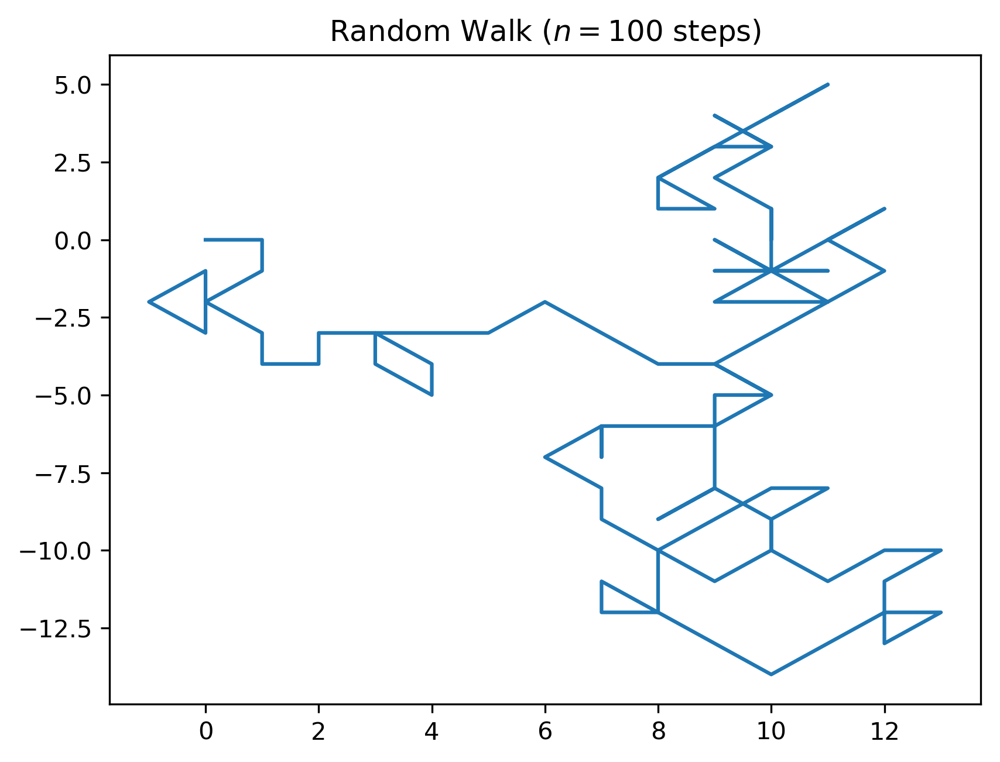

# Blind-Hiker
My work for Modelling and Simulation's task
## Required To Install
### -numpy
```
pip3 install numpy
```
### -matplotlib
```
pip3 install matplotlib
```
## Others
This will create a plot of a blind-hiker (8 directions according to compass). Just replace the n to change the number of steps.

